

  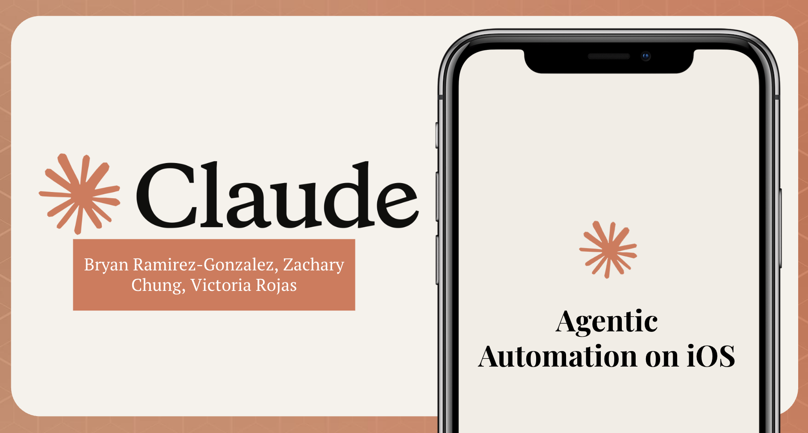

# Agentic Automation on iOS

**A voice-controlled Claude agent that drives a real iPhone — built so blind and low-vision users can operate any iOS app, not just Apple-native ones.**

🏆 3rd Place — Claude Builder Hackathon @ UCLA &nbsp;·&nbsp; 🔬 Continued as research at USC ISI (HUMANS Lab)

---

## Where's the code?

The full implementation is **private for now, on purpose**. This work is continuing as an open research effort at USC's Information Sciences Institute, and I'm still evaluating publication and research-sponsorship paths — until those decisions are made, the codebase stays closed so no option gets foreclosed.

Everything else lives here: the architecture, the measured benchmarks, the demos, and the design decisions. **If you're a recruiter, engineer, or researcher and want a code walkthrough, reach out — I'm happy to do one live.** [bryanram.com](https://bryanram.com) · [LinkedIn](https://www.linkedin.com/in/bryanrg22)

---

## What it does

Hold the iPhone's Action Button, speak a task — *"Open my most recent recruiter message on LinkedIn"* — and Claude takes over the physical phone: looking at the screen, tapping, typing, scrolling, and swiping through **~22 tool primitives**, while `AVSpeechSynthesizer` narrates every step out loud. A Node.js agent drives the device over USB through an XCTest bridge; a Swift companion app paints live progress into the Dynamic Island.

  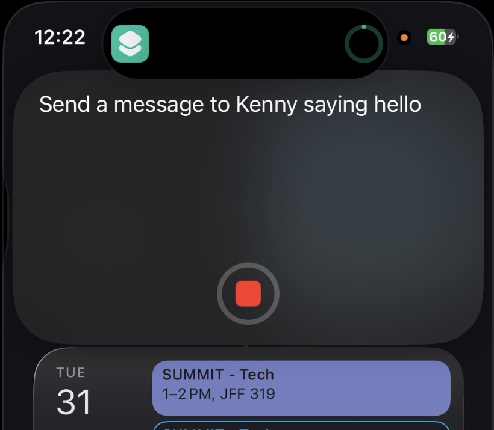
  &nbsp;&nbsp;
  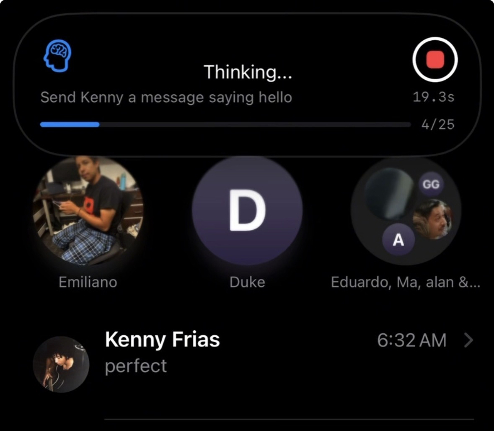
  &nbsp;&nbsp;
  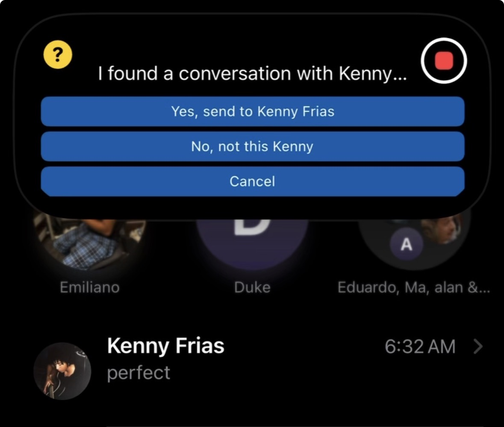

**Demos:** [full task end-to-end](docs/agentic_ios_demo.mp4) · [first autonomous multi-step drag on a physical iPhone](docs/agentic_ios_drag.mp4)

---

## The results

Six instrumented runs of the same task, one root-cause fix per run: **83 seconds and failing → 23.9 seconds, 4 steps — the theoretical minimum.**

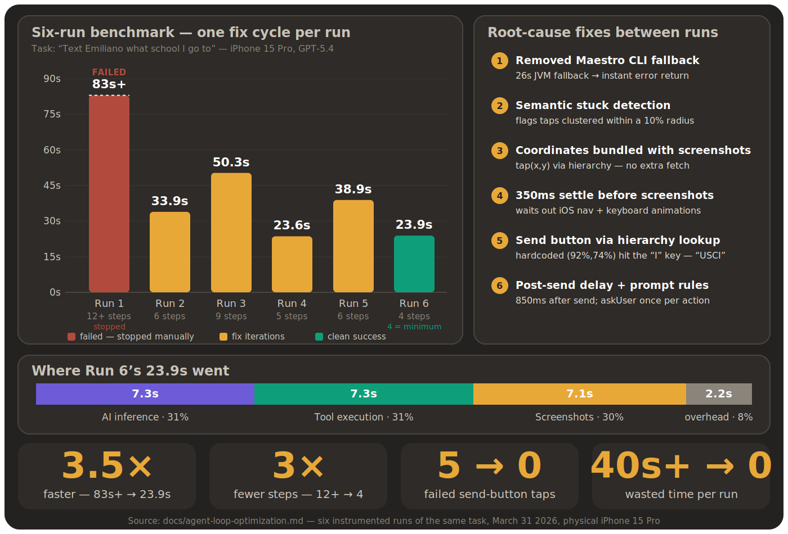

The composed optimizations behind it — prompt caching, rolling summaries, direct XCTest HTTP, 50× JPEG screenshot compression, semantic stuck detection, and CoALA-style memory:

  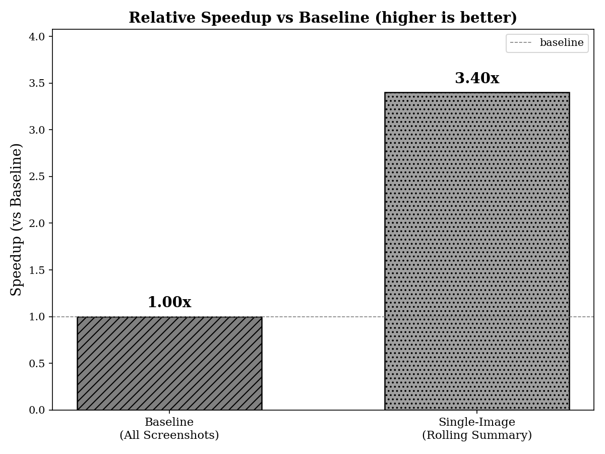
  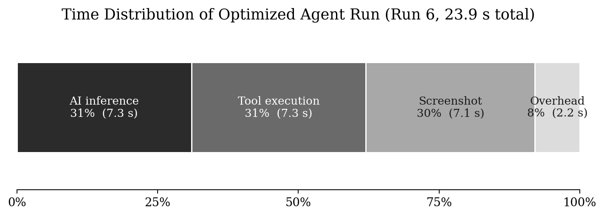

  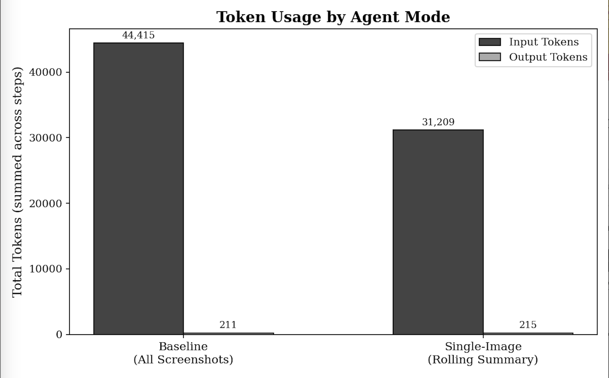

---

## How it works

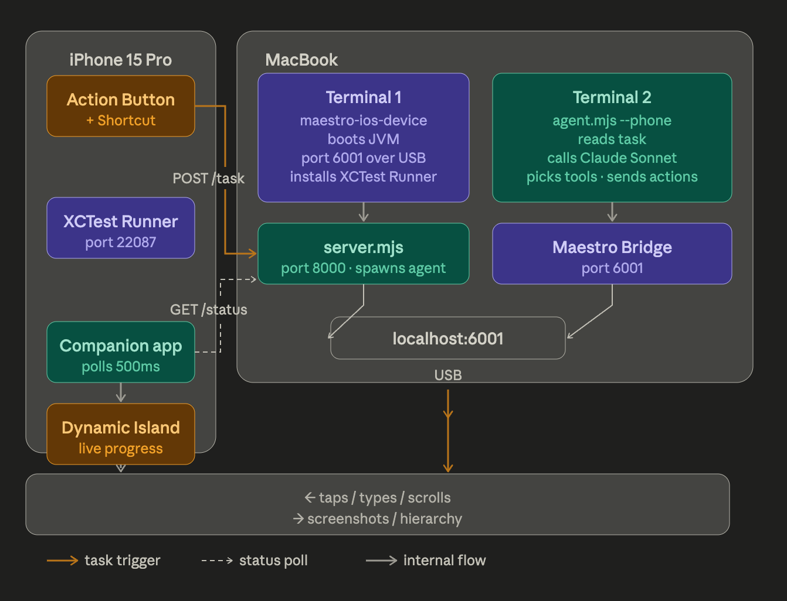

That's the Mac-hosted path. The same agent also runs **entirely on the phone** — the loop, in Swift, driving the on-device runner directly. The Mac only launches and holds the XCTest runner; after that, the *only* thing that leaves the device is the LLM call:

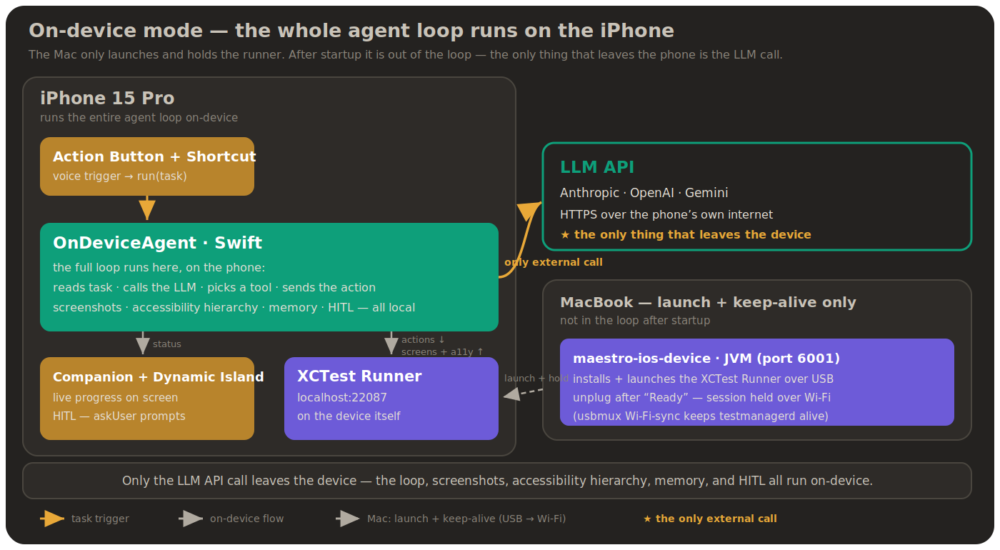

The per-step loop — screenshot + UI hierarchy in, one tool call out, auto-captured result back:

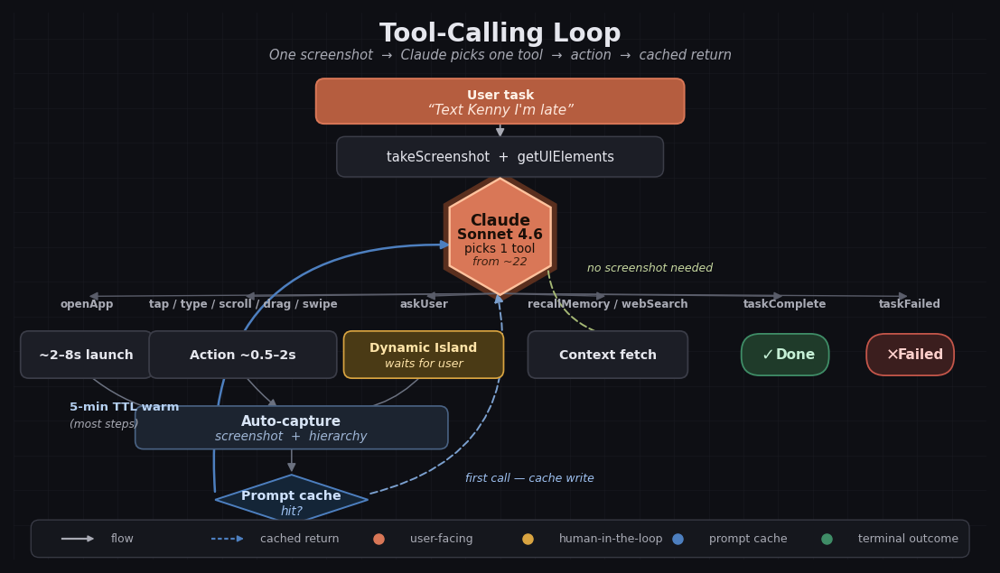

And the memory system that keeps a long task inside a small context window — three memory stores (semantic, episodic, procedural — the CoALA taxonomy), an XML-tagged prompt-cached system prompt, and a rolling summary that compresses history so each step carries a single screenshot:

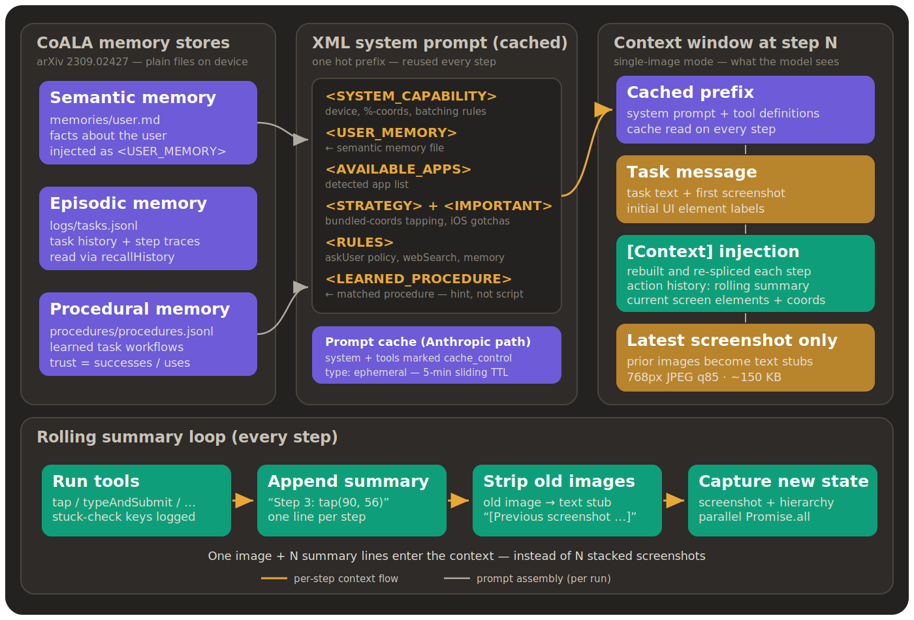

---

## The research

This project became the foundation of **iOS-Agent**, an open research platform for physical mobile GUI agents at USC ISI's HUMANS Lab — including a novel continuous-trajectory drag primitive (the first autonomous multi-step drag on a physical iPhone, on tasks where Mobile-Agent, AppAgent, and Mobile-Agent-v2 score near zero).

  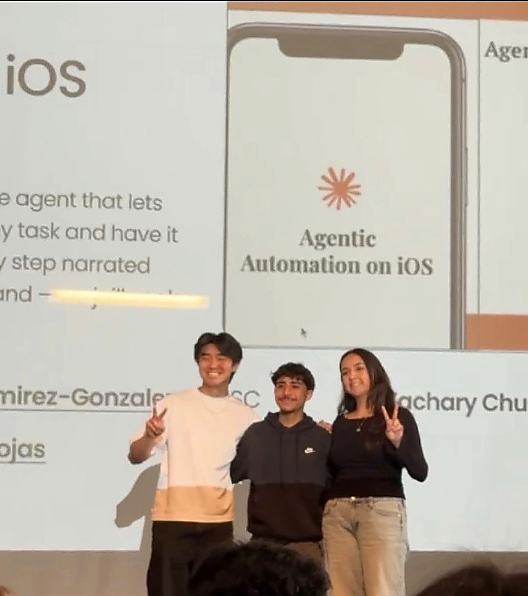

---

**Bryan Ramirez-Gonzalez** · USC CS '28 · [bryanram.com](https://bryanram.com) · [LinkedIn](https://www.linkedin.com/in/bryanrg22) · [GitHub](https://github.com/bryanrg22)

